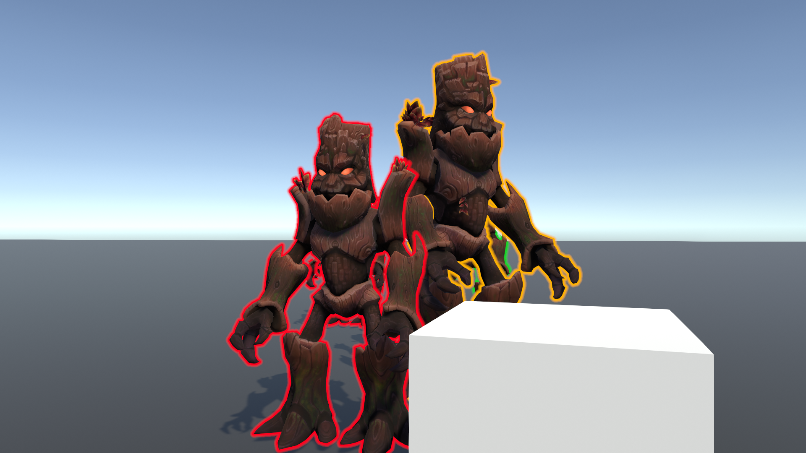
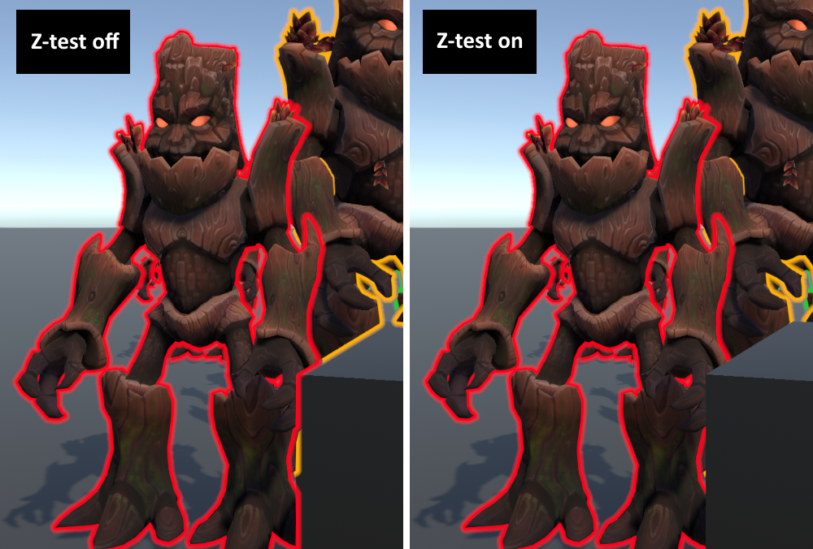

# Outline
### Features
* Тонкие и толстые обводки
* Жесткие и мягкие обводки
* Можно задавать цвета для отдельных объектов
* Обводки корректно скрываются окружением
* Обводки не сливаются в одну

### How
Использовал Jump Flood Algorithm. Все объекты для которых нужна обводка рендерятся в буффер силуэта. При этом опционально используется буффер глубины камеры, чтобы скрыть силуэт перекрытых окружением объектов. В этот буффер пишут свой ObjectID и ColorID. ObjectID отсортированы по Z расстоянию до камеры. Используя этот буффер как seed применяю JFA, с учетом не только расстояния между фрагментами, но и их ObjectID (для создания обводки между перекрывающимися объектами). После этого использую буффер с результатом JFA для композитинга обводки в сцену. Опционально можно провести тест глубины, что позволяет скрывать сам outline за окружением (а не только силуэт, см. скриншот ниже).

### Performance
На ноутбучной RTX 2060 занимает 0.8ms GPU при 4 итерациях JFA со включенным Z тестом на финальном пассе.

Производительность слабо зависит от числа объектов, так как оно влияет только на шаг с созданием буффера силуэта, который довольно дешев. 

Дорогая часть - JFA. Число итераций пропорционально log2 от толщины обводки в пикселях. 

В основном вся система memory access bound. Потенциальная оптимизация - делать все в уменьшенном разрешении. Однако при этом пострадает качество обводки (что может быть или не быть проблемой). 

### Problems
Не учитывает MSAA. В принципе возможно его добавить, однако вероятно уйдет возможность выставлять цвета обводки для отдельных объектов. MSAA позволяет работать в уменьшенном разрешении с сильно меньшей потерей качества. 

### Alternatives
Потенциальная альтернатива для требований ТЗ - mesh based outlines.
* Big Plus: Самый производительный вариант (намного быстрее JFA)
* Big Plus: Поддерживает окклюжен окружением, произвольные цвета и даже толщины обводки для каждого объекта без какого-либо эффекта на производительность
* Huge Minus: Требует специально подготовленные меши с гладкими нормалями (лишняя работа для моделлеров). Даже с ними обводка может "съезжать" с объекта или иметь разрывы. Требует танцев с бубном чтобы нормально работало со Skinned Meshes.
* Minus: Поддерживает только жесткую обводку 